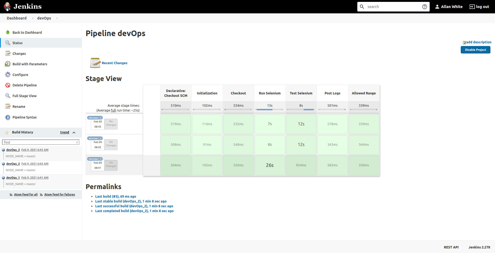
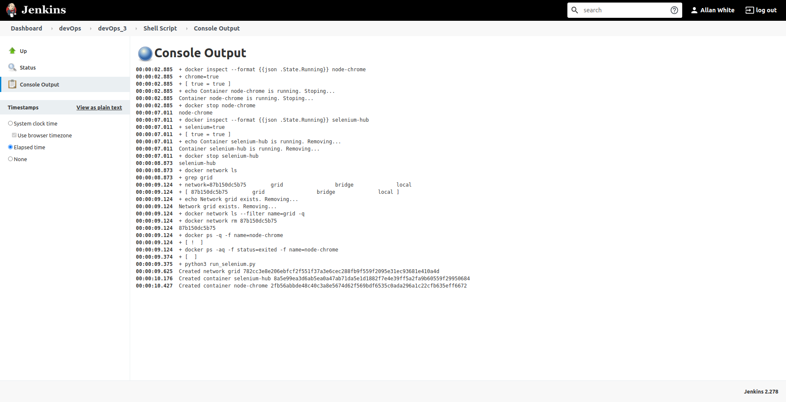

# Run docker containers on the same host inside dockerized Jenkins

Pipeline scripts utilize Docker SDK for Python
[docker-py](https://docker-py.readthedocs.io/).

CD into each folder for instructions.

