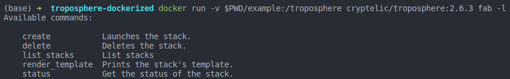

# Troposphere Dockerized

Build AWS stacks with
[Troposphere](https://github.com/cloudtools/troposphere).

Includes Fabric and the AWS CLI to help launch and manage stacks.

## Build the Docker image locally

    docker build -t cryptelic/troposphere:2.6.3 .

## Pull from Docker Hub

The image `cryptelic/troposphere` call be pulled:

    docker pull cryptelic/troposphere:2.6.3

## Run

The repo includes an example fabfile with tasks to build Troposphere templates
and manage stacks in Cloudformation. To get a list of available tasks in the
example fabfile:

    docker run -v $PWD/example:/troposphere cryptelic/troposphere:2.6.3 fab -l

To run a task that refer to AWS you have to export your AWS credentais to the
environment:

    export AWS_DEFAULT_REGION=us-west-2
    export AWS_ACCESS_KEY_ID=...
    export AWS_SECRET_ACCESS_KEY=...

    docker run -v $PWD/example:/troposphere \
    -e AWS_ACCESS_KEY_ID -e AWS_SECRET_ACCESS_KEY -e AWS_DEFAULT_REGION \
    cryptelic/troposphere:2.6.3 fab list_stacks
